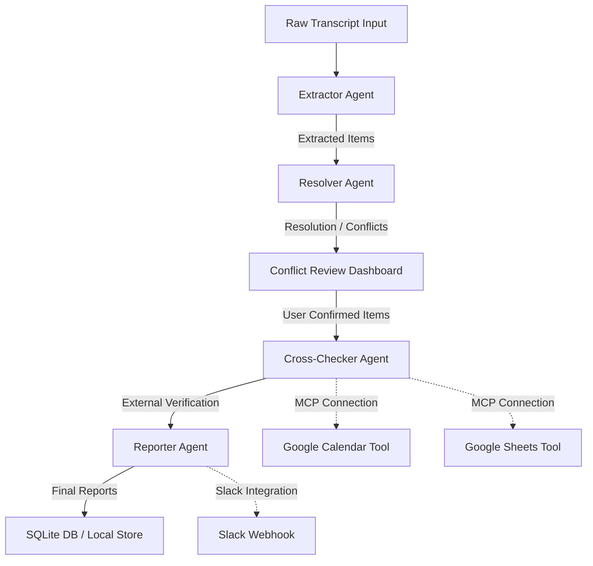

# MeetingMind — Intelligent Action Item Orchestrator

MeetingMind is a modern, Next.js-powered multi-agent pipeline that transforms raw meeting transcripts into structured, validated, and synchronized action items. By orchestrating a sequence of specialized AI agents, MeetingMind extracts context, resolves assignments, cross-checks tasks against external source data, and publishes updates to your productivity suite (Google Sheets, Google Calendar, Slack, etc.).

---

## 🚀 Key Features

- **Multi-Agent Pipeline**: Serialized orchestration through four distinct agent roles:
  1. **Extractor**: Identifies and isolates potential action items from messy transcript transcripts.
  2. **Resolver**: Enriches tasks with owner assignments, due dates, and performs semantic conflict resolution.
  3. **Cross-Checker**: Compares extracted tasks with existing calendar events and spreadsheets to prevent duplicates.
  4. **Reporter**: Generates comprehensive summaries and pushes notification updates to messaging platforms like Slack.
- **Model Context Protocol (MCP)**: Utilizes MCP client integrations to connect and synchronize directly with external calendars and spreadsheets.
- **Interactive Review Dashboard**: Real-time visualization of the pipeline status, active runs history, conflict reviews, and manual confirmation overlays.
- **Local Persistence**: Stores run histories, logs, and action items locally in a SQLite database.

---

## 📐 System Architecture

The following diagram illustrates how meeting transcripts flow through the multi-agent pipeline and connect to external integrations:



---

## 🛠️ Tech Stack

- **Framework**: [Next.js](https://nextjs.org/) (App Router, Tailwind CSS, TypeScript)
- **Runtime & Package Manager**: [Bun](https://bun.sh/) (or Node.js)
- **Database**: SQLite with local schema models (`lib/db.ts`)
- **Orchestration**: Custom asynchronous event loop orchestration (`lib/orchestrator.ts`)
- **External Sync**: Model Context Protocol (MCP) clients (`mcp/`)

---

## ⚙️ Getting Started

### Prerequisites

- **Bun** (recommended) or **Node.js** (v18+)
- A Google Cloud Console project with OAuth credentials enabled (for Sheets/Calendar integration)
- API keys for LLM services (Gemini, OpenAI, or Anthropic)

### 1. Installation

Clone the repository and install the dependencies:

```bash
cd meeting-mind
bun install
```

### 2. Environment Variables Configuration

Create a `.env` (or `.env.local`) file in the root directory and configure the following variables:

```ini
# LLM Providers (Configure at least one)
GEMINI_API_KEY=your_gemini_api_key
OPENAI_API_KEY=your_openai_api_key
ANTHROPIC_API_KEY=your_anthropic_api_key

# Google OAuth Credentials (for MCP Calendar/Sheets Sync)
GOOGLE_OAUTH_CLIENT_ID=your_google_client_id
GOOGLE_OAUTH_CLIENT_SECRET=your_google_client_secret
GOOGLE_REDIRECT_URI=http://localhost:3000/oauth/callback
SHEETS_SPREADSHEET_ID=your_google_sheet_id

# Slack Integration (Optional)
SLACK_WEBHOOK_URL=your_slack_webhook_url

# Optional Database Configurations
# SUPABASE_URL=your_supabase_url
# SUPABASE_ANON_KEY=your_supabase_key
```

### 3. Database Initialization

The SQLite database file `meetingmind.db` is initialized automatically on startup. If you ever need to reset or clear database runs, run the dev server and hit the reset endpoint or use the UI options:

```bash
# HTTP POST to reset mock database tables
curl -X POST http://localhost:3000/api/mock/reset
```

### 4. Running the Application

Start the development server:

```bash
bun dev
```

Open [http://localhost:3000](http://localhost:3000) in your browser to view the interactive dashboard.

---

## 📁 Repository Structure

```text
├── agents/                  # Multi-agent implementations (Extractor, Resolver, Cross-checker, Reporter)
├── app/                     # Next.js app pages, layouts, and API routes
│   ├── api/                 # Endpoint handlers for orchestrator stages and status controls
│   ├── review/              # Dashboard page view to review historical pipeline runs
│   ├── page.tsx             # Main dashboard interface
│   └── globals.css          # Core design token utilities
├── components/              # Interactive React/TypeScript dashboard UI components
├── lib/                     # Database models, schemas, store, and orchestrator workflow engine
├── mcp/                     # MCP client setup and Google Calendar/Sheets integrations
├── mcp.config.json          # Model Context Protocol server registrations
├── meetingmind.db           # Local SQLite database
├── kaggle_capstone_writeup.md  # Detailed technical capstone report
└── package.json             # Application dependencies and script commands
```

---

## 🛡️ License

This project is open-source and available under the MIT License.
